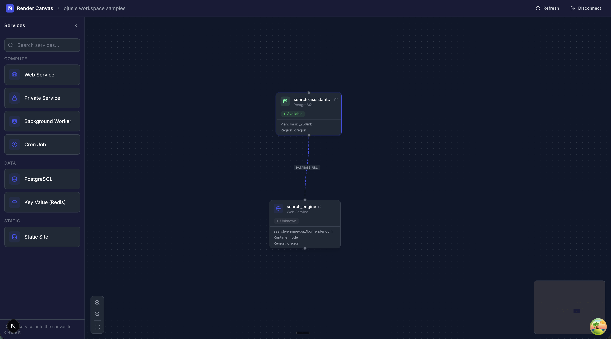

# Render Canvas

A visual canvas interface for managing your Render infrastructure. View, organize, and interact with your services, databases, and resources in an intuitive drag-and-drop environment.



## Features

- **Visual Infrastructure Management** - See all your Render services on an interactive canvas
- **Drag & Drop** - Organize services by dragging them around the canvas
- **Service Groups** - Create groups to organize related services together
- **Real-time Status** - View live status, metrics, logs, and deployments for each service
- **Environment Variables** - Manage env vars directly from the detail panel
- **Command Palette** - Quick access to actions with `Cmd/Ctrl + K`
- **Undo/Redo** - Full history support for canvas changes

## Supported Service Types

| Category | Services |
|----------|----------|
| **Compute** | Web Service, Private Service, Background Worker, Cron Job |
| **Data** | PostgreSQL, Key Value (Redis) |
| **Static** | Static Site |

## Getting Started

### Prerequisites

- Node.js 18+
- A [Render](https://render.com) account
- A Render API key (generate one from your Render dashboard under Account Settings → API Keys)

### Installation

```bash
npm install
```

### Running Locally

```bash
npm run dev
```

Open [http://localhost:3000](http://localhost:3000) in your browser.

### Setup

1. Enter your Render API key when prompted
2. Select a workspace (if you have multiple)
3. Your services will automatically load onto the canvas

## Usage Guide

### Navigating the Canvas

- **Pan** - Click and drag on the canvas background
- **Zoom** - Use scroll wheel or pinch gesture
- **Select Service** - Click on any service node to open the detail panel

### Managing Services

- **Create Service** - Drag a service type from the left sidebar onto the canvas
- **View Details** - Click a service to see overview, logs, deploys, metrics, env vars, and settings
- **Redeploy** - Use the redeploy button in the detail panel or context menu
- **Delete** - Right-click a service and select delete

### Organizing with Groups

- **Create Group** - Right-click on the canvas and select "Create Group"
- **Add to Group** - Drag services into a group node
- **Remove from Group** - Drag services out of the group

### Keyboard Shortcuts

| Shortcut | Action |
|----------|--------|
| `Cmd/Ctrl + K` | Open command palette |
| `Cmd/Ctrl + Z` | Undo |
| `Cmd/Ctrl + Shift + Z` | Redo |
| `Escape` | Close panel / deselect |

### Context Menus

Right-click on:
- **Canvas** - Create new services or groups
- **Service Node** - Redeploy, view details, or delete

## Tech Stack

- [Next.js](https://nextjs.org) - React framework
- [React Flow](https://reactflow.dev) - Canvas and node rendering
- [TanStack Query](https://tanstack.com/query) - Data fetching and caching
- [Zustand](https://zustand-demo.pmnd.rs) - State management
- [Tailwind CSS](https://tailwindcss.com) - Styling
